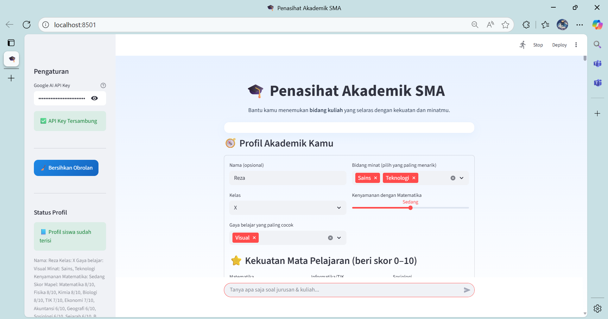
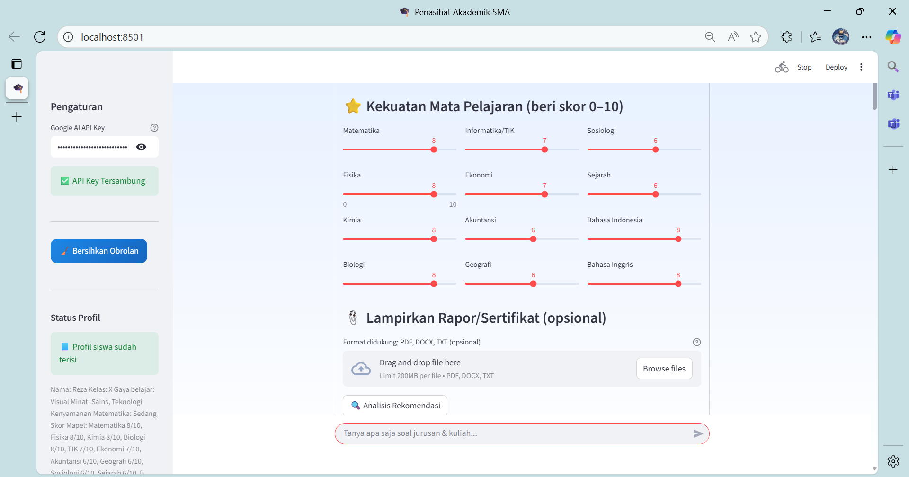
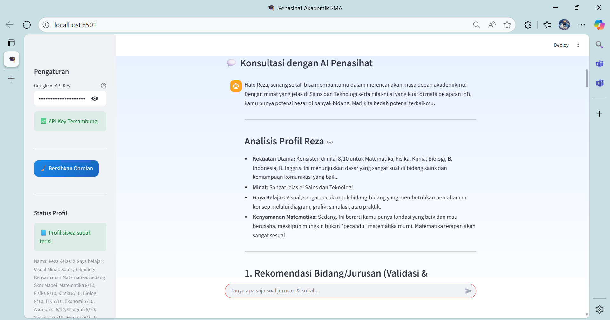
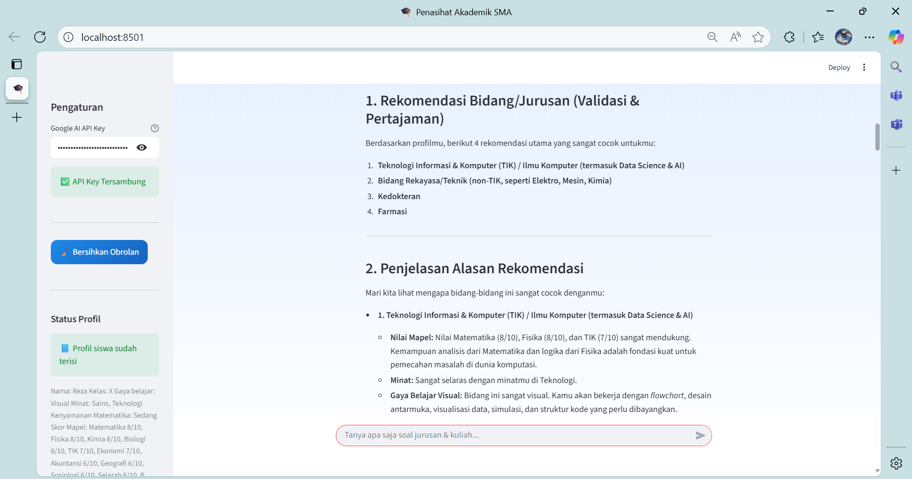
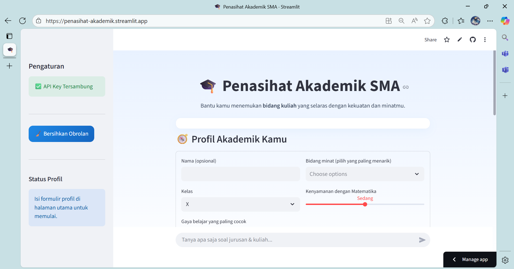

# 🎓 Penasihat Akademik SMA (Streamlit + Gemini + LangChain)

Aplikasi chatbot untuk membantu siswa SMA menentukan **jurusan/bidang kuliah** berdasarkan **kekuatan mata pelajaran**, **minat**, **gaya belajar**, dan **preferensi**. Mendukung **unggah rapor/sertifikat** (PDF/DOCX/TXT) sebagai konteks tambahan (RAG).

## ✨ Fitur Utama
- **Form Profil Akademik**: skor mapel (0–10), minat, gaya belajar, toleransi matematika.
- **Pemetaan Berbasis Aturan**: transparan dan bisa dikustomisasi untuk menghitung skor awal per bidang.
- **Validasi oleh Gemini**: model menyusun rekomendasi ringkas + rencana aksi 90 hari.
- **RAG dengan Lampiran**: jika ada rapor/sertifikat, kontennya dipakai sebagai konteks tambahan.
- **Chat Interaktif**: tanya apa saja soal penjurusan dan perbandingan bidang.
- **UI Bersih Bernuansa Biru**: ramah remaja, tidak berlebihan.

## 🧩 Arsitektur Singkat
- **Streamlit** untuk UI.
- **Google Gemini** untuk reasoning dan generasi rekomendasi.
- **LangChain + Chroma** untuk RAG (konteks profil + dokumen lampiran).
- **PyPDF2 & python-docx** untuk ekstraksi teks dari PDF/DOCX.

## 📦 Instalasi
Pastikan Python **3.10+** lalu jalankan:

```bash
git clone <repo-anda>
cd <folder-proyek>
pip install -r requirements.txt
```

## 🔑 Konfigurasi API Key
Masukkan **Google AI API Key** di sidebar aplikasi setelah berjalan. Alternatif (opsional), set environment variable:

```bash
export GOOGLE_API_KEY="YOUR_API_KEY"
```

> Catatan: aplikasi **tidak** mengakses internet untuk mengambil data eksternal; rekomendasi disusun dari profil dan pengetahuan umum model.

## 🚀 Menjalankan Aplikasi (Local)

```bash
streamlit run ai_penasihat_akademik.py
```

Buka URL yang ditampilkan (biasanya `http://localhost:8501`).

## 🖼️ App Screenshots (Local)
<p align="center">
  
  
  
  
</p>

## 🚀 Menjalankan Aplikasi Live Demo Di Streamlit Clouds
Klik link berikut : [Live demo](https://penasihat-akademik.streamlit.app/)

## 🖼️ App Screenshots (Streamlie)
<p align="center">
  
</p>

## 📝 Cara Pakai
1. Isi **Profil Akademik**: skor mapel, minat, gaya belajar, dan toleransi matematika.
2. (Opsional) unggah **rapor/sertifikat** (PDF/DOCX/TXT).
3. Klik **Analisis Rekomendasi** untuk mendapatkan daftar jurusan teratas + rencana aksi.
4. Lanjutkan **chat** untuk bertanya: perbandingan jurusan, alternatif minim Matematika, dsb.

## ⚙️ Kustomisasi
- Ubah **bobot mapel** di fungsi `skor_bidang_dari_map()` untuk menyesuaikan konteks sekolah/kurikulum.
- Tambah bidang baru dengan menambahkan entri pada peta bobot.

## 🛟 Troubleshooting
- **API Key tidak valid** → pastikan key benar dan aktif di Google AI Studio.
- **Dokumen gagal dibaca** → cek ulang format dan encoding (PDF/DOCX/TXT). Beberapa PDF hasil scan mungkin minim teks (gunakan OCR terlebih dulu).
- **RAG error/Chroma** → coba jalankan ulang; gunakan versi paket sesuai `requirements.txt`.

## 🔒 Privasi
- Data diproses secara lokal di aplikasi.
- Hindari memasukkan informasi sensitif.

## Live Demo

## 🙏 Acknowledgments
- Hacktiv8 Course : LLM Based Tools and Gemini API Integration for Data Scientists Partnership
- **[Adipta Martulandi](https://www.linkedin.com/in/adiptamartulandi/)** - Hacktiv8 Instructor 
- Chatbot [AI CV Assistant](https://cvassistant.streamlit.app/) by [@shadeq2022](https://github.com/shadeq2022)
- [Streamlit](https://streamlit.io/)
- [Google Gemini](https://ai.google.dev/)
- [LangChain](https://python.langchain.com/)
- [Chroma](https://www.trychroma.com/)

---
**Catatan etis**: Rekomendasi bersifat **panduan**. Diskusikan dengan orang tua/guru BK untuk keputusan akhir.
